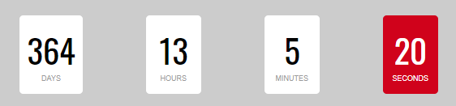

## AzCountdown 

A simple countdown using javascript for many uses



### how to use?

Charge the script in your page

```
<script src="https://page-of-you-use/folder-with-code/az-countdown.min.js"></script>
```

after using as you want, following the examples

#### <ins>Basic</ins>

```
new AzCountdown({
    date: '2022-12-17 12:00:00' //your future date
});
```

#### <ins>Specific div</ins>

By default the countdown is printed on the tag with the id "AzCountdown", but you can change this by passing in the id of a specific location you want

```
new AzCountdown({
    elementID: 'specificDiv'
});
```

#### <ins>Custom labels</ins>

```
new AzCountdown({
    labels: {
        days: 'DAYS LABEL',
        hours: 'HOURS LABEL',
        minutes: 'MINUTES LABEL',
        seconds: 'SECONDS LABEL'
    }
});
```

#### <ins>Custom layout</ins>

```
new AzCountdown({
    customLayout: {
        days: 'customNumberDays', // ID of the element where you want the day to be printed
        hours: 'customNumberHours', // ID of the element where you want the hours to be printed
        minutes: 'customNumberMinutes', // ID of the element where you want the minutes to be printed
        seconds: 'customNumberSeconds' // ID of the element where you want the seconds to be printed
    }
});
```

#### <ins>Remote infos</ins>

you can centralize the information in one page and use this same information in many coutdown page, for this you need use following tag ```<azcountdown>``` in your page when contain the informations as a exemple:

https://page-with-informations.com
```
<az-countdown>
    {
        "key" : "myKey",
        "date" : "2022-12-17 21:00:00"
    }
</az-countdown>
```

and then use in page with countdown with this


```
new AzCountdown({
    uri: 'https://page-with-informations.com',
    key: 'myKey'
});
```

the use of the key, is for use many times the same page with information